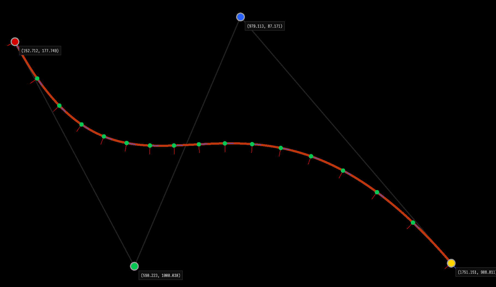

# README #

Exploring quadratic Bezier curves using Vulkan.

### References ###

* [Bezier Curves](https://pomax.github.io/bezierinfo/#toc)
* [Vulkan API](https://www.vulkan.org/)

### How do I get set up? ###

``` sh
cargo run --release
```

### Navigation ###
- Control + Left click to place 4 control points
- Left click a control point and drag it to change its location


